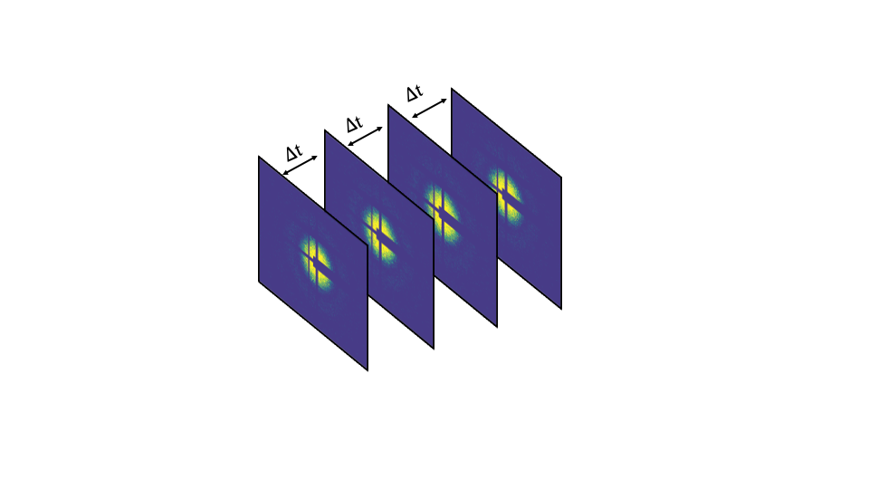

# Dynamics of liquids in microchannels using high resolution spectroscopy
This project studies time-resolved changes using X-ray Photon Correlation Spectroscopy (XPCS), a scattering technique to study the dynamics of condensed matter systems. The aim of this project is to study the behavior of complex fluid flows with nanoparticle spheres in particular, flow velocity profiles from the X-ray data from 2D detector.

Step-1

First we obtain the intensity autocorrelation functions $g^{(2)}$ stored as a Unique Indentification Number in the 2D detector after the experiment.
